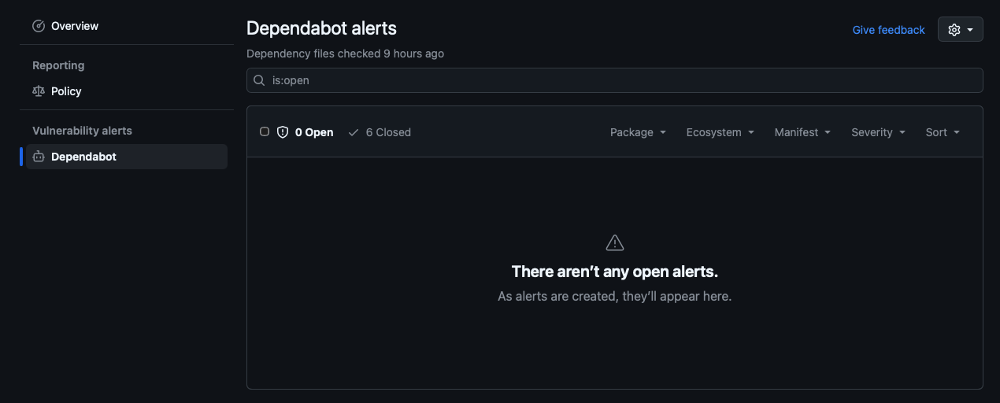

# Source Code Management

We use private [Git](https://git-scm.com/) repositories hosted on [GitHub](https://github.com/).

Git tracks all of our code changes over time and supports check-in, check-out, roll-back, and merging.

## Common Git Commands
```bash
# clone repository
git clone git@github.com:git-username/git-project.git

# checkout staging branch
git checkout staging

# fetch latest changes
git pull

# create feature branch
git checkout -b feature/deployment-scripts

# see local status
git status

# stage a file
git add directory/ path/to/filename

# commit staged changes
git commit -m "Added Capistrano deployment scripts"

# push local commits to GitHub
git push -u origin feature/deployment-scripts

# view commit history
git log --oneline --graph --decorate --all

# delete feature branch after PR merge to main
git push origin --delete feature/deployment-scripts
```

## Security Checks

### Github Dependabot

We utilize Github Dependabot to do security checks on all our framework packages.

